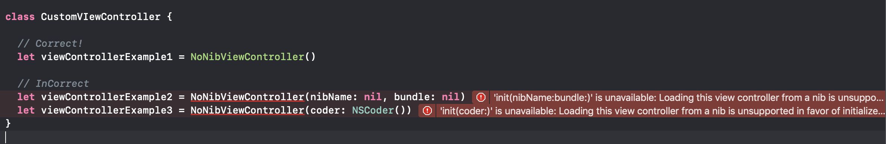
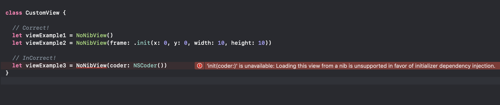

# NoNibComponent
This library is used to create UIComponent programmatically without using xib or storyboard


[](https://travis-ci.org/interactord/NoNibComponent)
[](https://cocoapods.org/pods/NoNibComponent)
[](https://cocoapods.org/pods/SCDataStructure)
[](https://cocoapods.org/pods/NoNibComponent)

# 📚 Overview

+ **Using ViewController Type**:


+ **Using View Type**:



# Installation

* **Using [Cocoapods](https://cocoapods.org)**:
    ```ruby
    pod 'NoNibComponent'
    ```

* **Using [Carthage](https://github.com/Carthage/Carthage)**:
    ```ruby
    github 'interactord/NoNibComponent'
    ```

## License
NoNibComponent is under MIT license. See th [LICENSE](LICENSE.md) file for more info.
